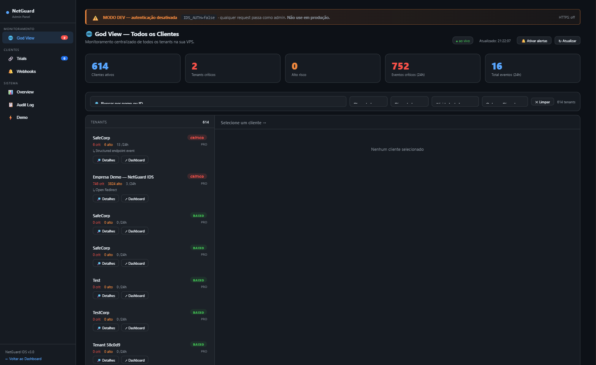
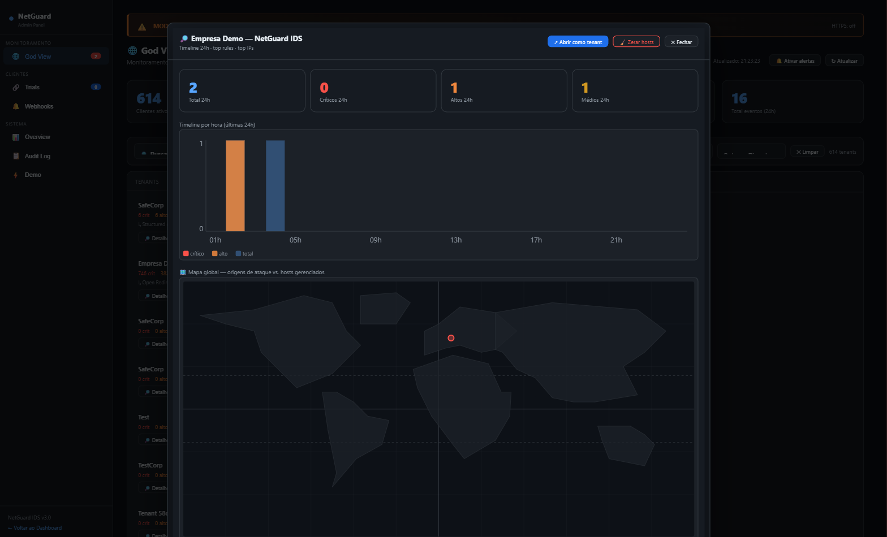
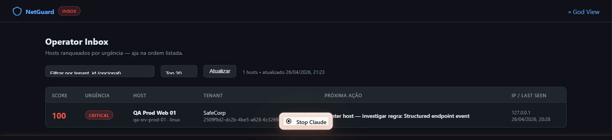
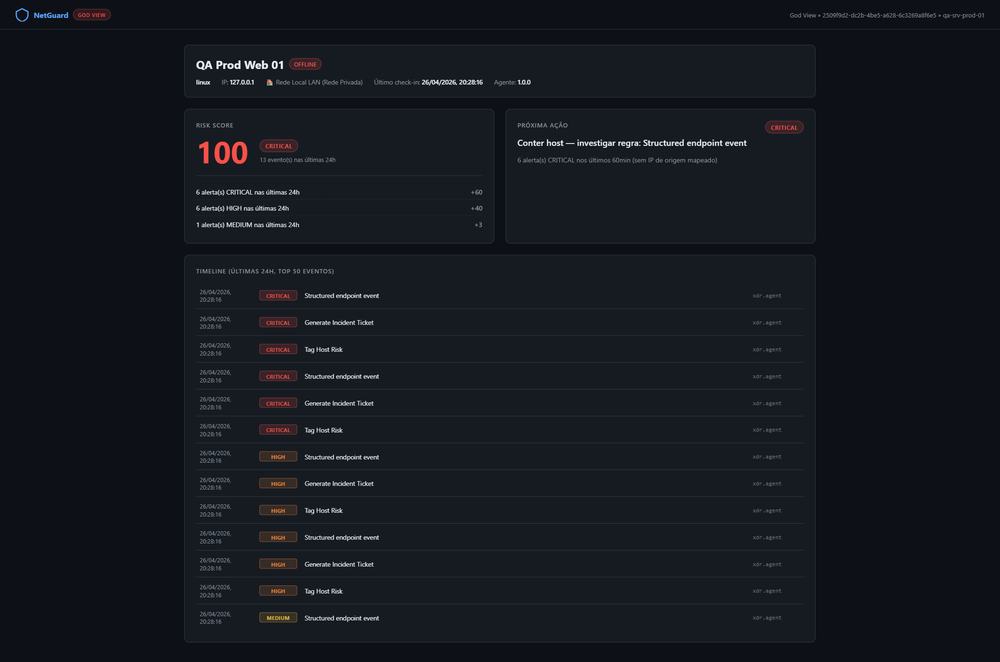

# NetGuard IDS

A host-centric **Intrusion Detection / EDR / SIEM hybrid** built in Python — single-binary SOC dashboard, multi-tenant SaaS layer, deterministic risk scoring, and a one-click Host Triage View that gets the operator from "something is wrong" to "this is the next action" in a single click.

[](https://python.org)
[](https://flask.palletsprojects.com/)
[](https://attack.mitre.org)
[](run_pentest_audit.py)
[](LICENSE)
[](DOCKER.md)

> **Status:** active solo project, ~135 commits. The codebase is shipped through small T-rounds (T6 → T15) — each round adds a feature **and** a regression test in `run_pentest_audit.py`. Every merge to `main` keeps the suite at green.

---

## Why this exists

Most open IDS/EDR tools either (a) drown an analyst in raw events with no priority, or (b) hide the *why* of a verdict behind a black-box ML model. NetGuard takes the opposite stance:

- **Determinist risk scoring.** Every host risk number ships with its own breakdown (`"3× CRITICAL = +60 (cap)"`). No ML, no caixa-preta — auditors and SOC leads can reproduce the score from rules.
- **One-click triage.** Operator opens *Host Triage View* → sees risk + 50-event timeline + a single recommended next action with rationale. No multi-tab dance.
- **Cross-tenant inbox.** Admins get a single pane that ranks the worst hosts across **all** tenants by score — built for a small MSSP-style operator running 5–50 customers from one console.

If you build a SOC for a small org and don't want to pay $30k/year for a SaaS that hides its math, this is the shape of tool you'd reach for.

---

## What's inside

| Capability | Where |
|---|---|
| Multi-tenant SaaS (admin god-view + tenant drilldown) | `app.py` admin routes + `templates/admin_dashboard.html` |
| **Host Triage View** — risk score, next action, 50-event timeline | `/admin/host/<tenant>/<host>` ([T14](SECURITY_REPORT_T14.md)) |
| **Operator Inbox** — cross-tenant ranking by risk | `/admin/inbox` |
| Deterministic risk scoring + rule-based "next action" | `_host_risk_score`, `_host_next_action` in `app.py` |
| World-map view of threat sources (GeoLite2 + prefix DB) | `admin.html` god-view, [T10](SECURITY_REPORT_2026-04-25.md) |
| XDR-style endpoint ingest with strict event whitelist | `/api/events`, `/api/xdr/events`, `/api/agent/events` |
| Sigma-like YAML rules with aggregation windows | `rules/yaml/` + `rules/yaml_loader.py` |
| Incident lifecycle (status, severity, assign, comments) | `engine/incident_engine.py` |
| RBAC (admin / analyst / viewer) + audit log | `auth.py` + `audit.log()` calls across `app.py` |
| BruteForceGuard with escalating lockout | `auth.py` |
| CSRF (cookie + `X-CSRFToken` header) on every destructive admin endpoint | covered by `t11a` regression |
| SameSite cookie posture (Strict admin / Lax tenant) | covered by `t12b`, `t13a` |

---

## Screenshots

> Captured live from the running app at `127.0.0.1:5000` on a seeded multi-tenant database (~614 active clients across ~20 tenants).

### God View — multi-tenant overview



Top of the admin dashboard: every tenant ranked by critical/high event count in the last 24h, total active clients, and a single "worst tenants" leaderboard. Built for a small MSSP-style operator running 5–50 customers from one console.

### Tenant drilldown — timeline + threat origins



Per-tenant view: events-by-hour bar chart and a world map plotting attack source IPs against managed hosts (GeoLite2 + prefix DB). The red dot on the right is a single attack origin from this tenant's last 24h window.

### Operator Inbox — cross-tenant ranking



`/admin/inbox` — every host across every tenant ranked by deterministic risk score, with a single "Próxima Ação" column already filled in. The inbox is the answer to "I have 60 customers, where do I look first."

### Host Triage View — risk + next action + 50-event timeline



`/admin/host/<tenant>/<host>` — the centerpiece of T14 + T15. Risk score with full breakdown (`6× CRITICAL = +60 (cap)`, `6× HIGH = +40`, `1× MEDIUM = +3`), a single recommended next action with rationale, and the enriched 50-event timeline (process_name, command_line, source_ip on each row). One click from the inbox to here, no multi-tab dance.

---

## Quick start

```bash
git clone https://github.com/raphaelguterres/netguard-ids.git
cd netguard-ids
python -m venv .venv && . .venv/bin/activate
pip install -r requirements.txt
cp .env.example .env
python app.py
```

Open:

- **Admin dashboard:** `http://127.0.0.1:5000/admin` (token in `.netguard_token`)
- **Tenant SOC:** `http://127.0.0.1:5000/soc-preview`
- **Health:** `http://127.0.0.1:5000/api/health`

Run the regression suite (static AST + grep checks across `app.py` and templates):

```bash
python run_pentest_audit.py
# === 34/34 passaram ===
```

---

## Endpoint agent

NetGuard currently ships two agent tracks:

- `agent/`: production-oriented Windows endpoint runtime, `agent.exe`, offline buffer, service mode, canonical `POST /api/events`
- `netguard_agent/`: compatibility runtime used by older flows and demos

The new Windows/runtime-focused agent lives in `agent/`:

```bash
cd agent
python -m agent
```

Recommended secure enrollment flow:

```bash
# Admin/analyst creates a short-lived enrollment token.
curl -X POST http://127.0.0.1:5000/api/agent/enrollment-token \
  -H "X-API-Token: <admin-or-analyst-token>" \
  -H "Content-Type: application/json" \
  -d '{"tenant_id":"default","expires_in_seconds":3600,"max_uses":1}'

# Endpoint registers once with the nge_... token and receives a host key.
curl -X POST http://127.0.0.1:5000/api/agent/register \
  -H "Content-Type: application/json" \
  -d '{"host_id":"lab-win-01","platform":"windows","enrollment_token":"nge_..."}'
```

The issued `nga_...` host key is stored by the agent in its local credential
store for unattended restarts. Windows uses DPAPI when available.

To build the standalone Windows binary:

```powershell
cd agent
powershell -ExecutionPolicy Bypass -File .\build_agent.ps1 -Clean -WithService
# -> dist\agent.exe
```

The compatibility XDR collector in `netguard_agent/` still ships events with a host API key:

```bash
python -m netguard_agent \
  --hub http://127.0.0.1:5000 \
  --token YOUR_BOOTSTRAP_TOKEN \
  --host-id lab-win-01 \
  --mode xdr
```

Or with an issued host key (`nga_...`):

```bash
python -m netguard_agent \
  --hub http://127.0.0.1:5000 \
  --agent-key nga_ISSUED_HOST_KEY \
  --host-id lab-win-01 \
  --mode xdr
```

---

## Foundation already in place

- Flask server with REST API and SOC dashboard
- Modular `/agent` runtime with `agent.exe` build path and Windows service wrapper
- Modular endpoint agent (`netguard_agent/`) with legacy and XDR transport modes
- Host enrollment and inventory registry
- Structured endpoint event ingest (`/api/events`, `/api/agent/events`, `/api/xdr/events`)
- RBAC-aware auth model (`admin`, `analyst`, `viewer`)
- Incident lifecycle API with status, severity, assignment, and comments
- SQLite-first storage for local/demo, with repositories written to be PostgreSQL-ready
- Sigma-like YAML rules loaded from `rules/yaml/`

The project still runs locally with the current app entrypoint, but it is organized to support a more professional Agent + Server model.

## Operating Modes

| Mode | Storage | Auth posture | Typical use |
|------|---------|--------------|-------------|
| Local dev | SQLite | `IDS_AUTH=false` on loopback only | Fast desktop iteration |
| Demo / preview | SQLite | Token or preview flow | Portfolio demos and customer preview |
| Production | PostgreSQL recommended | `IDS_AUTH=true`, dashboard auth, reverse proxy/TLS | VPS, cloud, small SaaS deployment |

Important hardening already enforced:

- `TOKEN_SIGNING_SECRET` is mandatory outside `dev/test`
- Startup fails closed if `IDS_AUTH=false` is exposed outside loopback unless explicitly bypassed
- Admin rate limiting uses shared SQLite storage per host
- Audit logs rotate and retain automatically
- Background jobs do not autostart on import in WSGI/Gunicorn mode

## Architecture

See the full architecture note in [NETGUARD_AGENT_SERVER_ARCHITECTURE.md](NETGUARD_AGENT_SERVER_ARCHITECTURE.md).

High-level flow:

```text
netguard_agent / external producers
        |
        +--> POST /api/events
        +--> POST /api/agent/register
        +--> POST /api/agent/heartbeat
        +--> POST /api/agent/events
        +--> POST /api/xdr/events
                    |
                    v
             XDR pipeline
     normalize -> detect -> correlate
        -> score host -> persist events
        -> create response actions
        -> feed incidents / SOC views
                    |
                    v
     repositories (SQLite local, PostgreSQL-ready)
        - EventRepository
        - HostRepository
        - IncidentRepository
                    |
                    v
      SOC dashboard + incidents + reporting APIs
```

Core building blocks:

- `agent/`: Windows-first endpoint runtime, offline buffer, service wrapper, PyInstaller build
- `netguard_agent/`: compatibility endpoint collector and transport runtime
- `server/agent_service.py`: host enrollment and agent auth rules
- `server/api.py`: modular API blueprint for `POST /api/events`
- `storage/event_repository.py`: event/tenant storage abstraction
- `storage/host_repository.py`: enrolled host registry and API key validation
- `storage/incident_repository.py`: incident lifecycle persistence
- `engine/incident_engine.py`: incident business logic
- `rules/yaml_loader.py`: Sigma-like YAML rule loading and validation
- `xdr/`: endpoint schema, detections, pipeline, and agent-side transport helpers

## Authentication and Authorization

NetGuard now supports multiple access models:

- Admin token from `.netguard_token`
- Tenant tokens (`ng_...`) stored in the repository
- Host API keys (`nga_...`) for enrolled agents

RBAC is enforced across sensitive flows:

- `admin`: full platform access
- `analyst`: operational access to incidents, hosts, and agent enrollment
- `viewer`: read-oriented access, no host enrollment or incident mutation

Sensitive actions emit audit entries, and incident changes are timeline-backed.

## Detection and Rule Model

The project now supports two complementary rule layers:

- Built-in behavioral/XDR detections in `xdr/detections/`
- Folder-backed YAML rules in `rules/yaml/`

Included YAML examples:

- `rules/yaml/suspicious_powershell.yml`
- `rules/yaml/bruteforce.yml`
- `rules/yaml/port_scan.yml`

These rules support:

- field matching (`equals`, `contains`, `regex`, numeric comparisons)
- `all` / `any` matching blocks
- simple aggregation windows (`count`, `within_seconds`, `group_by`, `distinct_field`)
- Sigma-like metadata (`level`, `status`, `references`, `falsepositives`, `logsource`)
- Sigma-like selections such as `detection.selection` with `condition: selection`
- common Sigma field modifiers (`CommandLine|contains`, `Image|endswith`, `field|regex`)

The Sigma compatibility layer is intentionally conservative. It supports the subset needed for portable endpoint/process/network/auth rules while rejecting ambiguous mixed logical expressions instead of silently weakening detections.

Operators can inspect loaded built-in and YAML detection content through `/api/detection/rules`, including MITRE coverage, event-type coverage, and YAML files skipped during validation.

## Main Endpoints

### Agent and ingest

| Endpoint | Method | Purpose |
|----------|--------|---------|
| `/api/events` | `POST` | Canonical EDR ingest endpoint secured by `X-API-Key` |
| `/api/agent/enrollment-token` | `POST` | Create a short-lived one-time/semi-bulk enrollment token |
| `/api/agent/enrollment-token/revoke` | `POST` | Revoke an unused enrollment token by raw value |
| `/api/agent/register` | `POST` | Enroll a host and issue a host API key |
| `/api/agent/hosts/<host_id>/revoke` | `POST` | Revoke a host key while preserving telemetry/history |
| `/api/agent/hosts/<host_id>/actions` | `POST` | Queue a response action for an enrolled host |
| `/api/agent/actions/<action_id>/cancel` | `POST` | Cancel a pending/leased response action |
| `/api/agent/actions` | `GET` | Agent polling endpoint for leased response actions |
| `/api/agent/actions/<action_id>/ack` | `POST` | Agent ACK endpoint for completed/refused/failed actions |
| `/api/agent/heartbeat` | `POST` | Update host liveness, version, and metadata |
| `/api/agent/events` | `POST` | Ingest agent events using host key or token |
| `/api/xdr/events` | `POST` | Generic structured endpoint event ingest |
| `/api/agent/status` | `GET` | Agent inventory status view |
| `/api/detection/rules` | `GET` | Detection rule catalog, MITRE/event coverage, YAML load health |

### Incidents and SOC

| Endpoint | Method | Purpose |
|----------|--------|---------|
| `/api/incidents` | `GET` | List incidents and summary stats |
| `/api/incidents` | `POST` | Create incident manually or from `event_id` |
| `/api/incidents/<id>` | `GET` | Incident details and timeline |
| `/api/incidents/<id>/status` | `PATCH` | Update status (`open`, `investigating`, `resolved`, etc.) |
| `/api/incidents/<id>/severity` | `PATCH` | Update severity |
| `/api/incidents/<id>/comments` | `POST` | Add analyst comment |
| `/api/incidents/<id>/assign` | `POST` | Assign an owner |
| `/soc-preview` | `GET` | Public preview of the SOC experience |
| `/soc/incidents` | `GET` | Authenticated incidents queue |
| `/soc/hosts/<host_id>/actions` | `POST` | Queue safe host response actions from the SOC host detail view |
| `/soc/hosts/<host_id>/actions/<action_id>/cancel` | `POST` | Cancel a pending/leased host response action from SOC |
| `/soc/grid` | `GET` | Integrated EDR/SOC grid backed by the modular repository |

SOC host detail currently exposes only safe response actions by default:
`ping`, `collect_diagnostics`, and `flush_buffer`. Destructive endpoint
actions such as isolation, process kill, IP block, and file deletion are
blocked server-side unless an admin supplies a short-lived HMAC policy
approval using `NETGUARD_RESPONSE_POLICY_SECRET`; the agent still refuses
execution by default until endpoint-side destructive handlers are explicitly
implemented and enabled.

### Platform

| Endpoint | Method | Purpose |
|----------|--------|---------|
| `/api/health` | `GET` | Health and subsystem status |
| `/api/hosts` | `GET` | Host-centric inventory, risk, and telemetry summary |
| `/metrics` | `GET` | Prometheus metrics |
| `/demo` | `GET` | Demo bootstrap flow |
| `/trial/<token>` | `GET` | Trial access flow |

## Storage Strategy

NetGuard keeps SQLite as the default local/demo backend, but the storage layer is now structured so production can move to PostgreSQL without rewriting business logic.

Current repository abstractions:

- `EventRepository`: events, tenants, onboarding artifacts
- `HostRepository`: managed hosts, API key hashes, heartbeat metadata
- `IncidentRepository`: incidents and incident timeline records

This makes it easier to:

- keep desktop demos frictionless
- move SaaS or VPS installs to PostgreSQL
- write tests against business logic without coupling every feature to `app.py`

## Testing

Run the focused regression suite for the new architecture:

```bash
python -m pytest \
  tests/test_agent.py \
  tests/test_agent_xdr.py \
  tests/test_xdr_pipeline.py \
  tests/test_agent_server.py \
  tests/test_incident_engine.py \
  tests/test_incidents_api.py \
  tests/test_yaml_rules.py \
  tests/test_api_endpoints.py \
  tests/test_integration.py \
  tests/test_security.py -q
```

The new coverage adds checks for:

- agent registration, heartbeat, and event ingest
- agent RBAC enforcement
- incident engine lifecycle and grouped EDR alerts
- incident API create/update/comment flows
- YAML rule loading and aggregation behavior

## Production and Ops Docs

- [DEPLOY.md](DEPLOY.md): deployment patterns and production checklist
- [SECURITY.md](SECURITY.md): hardening notes and security posture
- [NETGUARD_AGENT_SERVER_ARCHITECTURE.md](NETGUARD_AGENT_SERVER_ARCHITECTURE.md): Agent + Server architecture
- [DOCKER.md](DOCKER.md): containerized execution

## Realistic Roadmap

- [x] Agent + Server foundation with host enrollment and structured endpoint ingest
- [x] Incident API with severity, status, assignment, and comments
- [x] YAML rule loader with bundled examples
- [x] Repository abstraction for hosts and incidents
- [x] Persistent host-key credential store, short-lived enrollment tokens, and host key revocation
- [x] Server-to-agent response action queue with polling, ACK, and safe agent executor
- [x] Server-side signed policy gate for destructive response action queuing
- [ ] Database migrations for production upgrades
- [ ] Agent packaging as service/daemon for Windows and Linux
- [ ] Endpoint-side destructive response handlers with signed policy enforcement
- [ ] Redis/shared cache options for multi-node production topologies
- [ ] Tenant-scoped API tokens with narrower operational scopes

## License

MIT © Raphael Guterres
